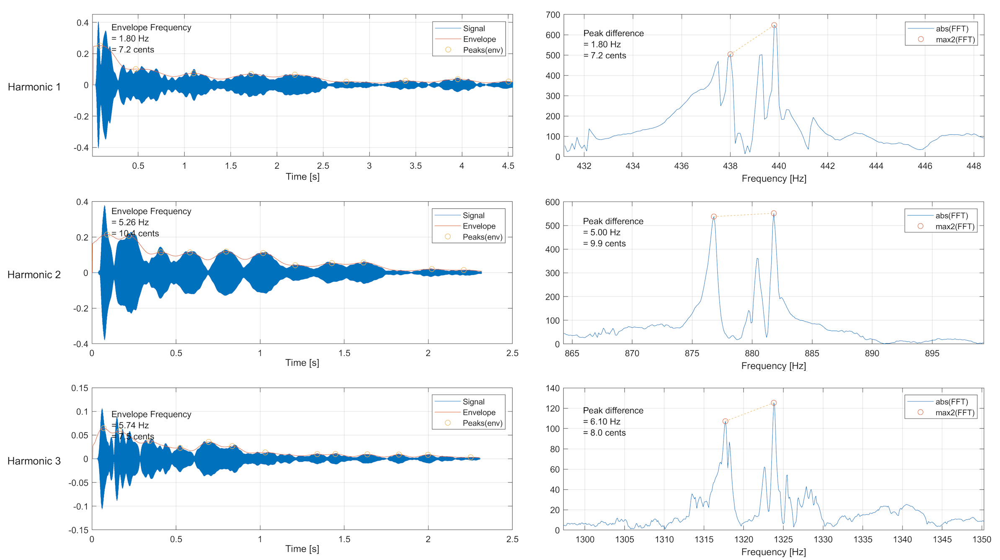

# 🎹 Piano Tuner – Real‑Time Detuning and Beating Analysis

A complete MATLAB tool for analyzing and tuning piano notes by detecting small frequency differences between strings of the same note. These differences create the characteristic *beating* effect heard when a note is slightly out of tune.

The system combines frequency‑domain and time‑domain analysis to estimate detuning in **Hz** and **cents**, and presents the results through clear, intuitive visualizations, that help you in the tuning process.

The code is modular and easy to extend. Feel free to add your contributions if you want!

<p align="center">
  
  
</p>

---

## 📌 Project Overview

Most piano notes are produced by three strings tuned to the same frequency.  
When one string drifts slightly sharp or flat, the resulting interference causes a slow amplitude modulation — the *beating effect*.
This tool analyzes a recorded piano note to:

- Identify the strongest three harmonic components
- Measure the beating frequency through envelope analysis  
- Detect peak differences in the spectrum  
- Estimate detuning in **Hz** and **cents**  
- Visualize all results in an interpretable way  

The workflow is summarized in the following figure:


And an example analysis of the recorded note in `dataset/A4.ogg`:



---

## ✨ Features

- Automatic detection of the three strongest harmonic components
- Envelope‑based beating frequency estimation  
- Narrowband spectral analysis around each harmonic  
- Detuning measurement in **Hz** and **cents**   
- Clear visual plots for interpretation  

---


## 🚀 How to Use

1. **Record a piano note** (preferably one that is slightly out of tune) and place the audio file in the `dataset/` folder.  
   - Use `.wav` for older MATLAB versions.

2. **Edit the file name** in `Main.m`:
   ```matlab
   audioread('dataset/your_file.ogg');

---

## 📈 What the Program Analyzes
### Harmonic Estimation
The signal is transformed into the frequency domain, and the three strongest harmonic peaks are identified. These serve as reference points for the rest of the analysis.

### Envelope Analysis
Slightly detuned strings produce a slow amplitude modulation.
The tool extracts the envelope and estimates the beating frequency, which corresponds to the detuning between strings.

### Peak‑Difference Analysis
For each harmonic, two nearby spectral peaks are detected.
Their separation gives the detuning:

In Hz — absolute frequency difference

In cents — musical interval relative to the next semitone

This helps determine whether the note is stable or producing audible beating, and whether a string is sharp or flat.

---

## 💻 Requirements
Development environment
MATLAB R2019a

Signal Processing Toolbox 8.2

Minimum recommended version
MATLAB R2018a

Signal Processing Toolbox R2018a

All required functions (findpeaks, designfilt, lowpass, envelope, movmean) are available from R2018a onward.

